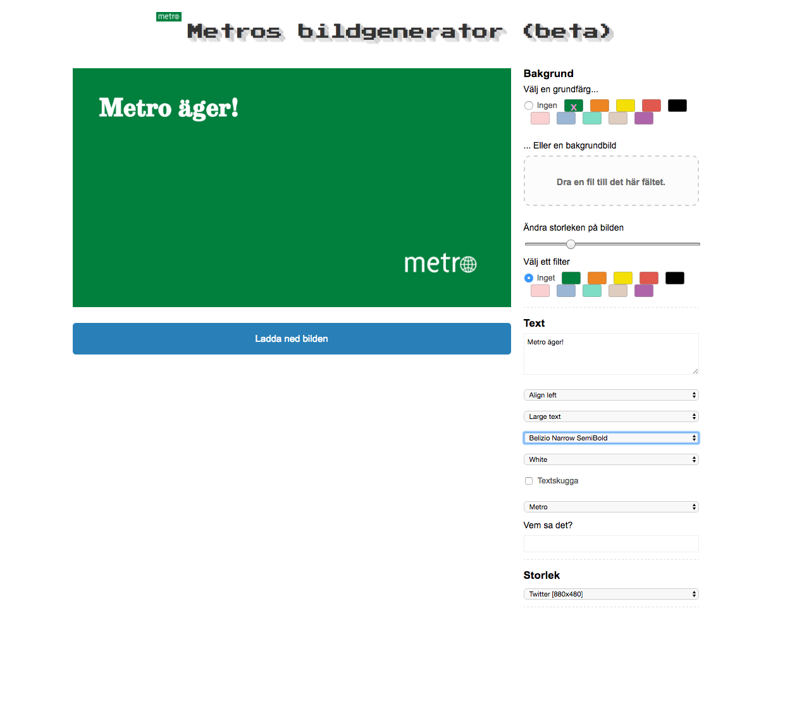

# Meme (Metro remix)

Meme is a generator to create social sharing images.
This is the Metro Swedens fork based on the Los Angeles Times fork of Vox Medias original.

A usable version can be found at [http://www.hugoewald.se/meme](http://www.hugoewald.se/meme).



How to deploy 
-------------------------------

**Edit the ``source`` directory to make the changes you want**

You can fire up the test server locally by running:

```bash
$ make serve
```

**Build the source files into a working static site**

Like so:

```bash
$ make build
```

**Commit your work**

Use Git to commit your work to our repository.

```bash
# Add the changes
$ git add .
# Log your work
$ git commit -m "A precise message goes here"
# Push it up to GitHub
$ git push origin master
```
